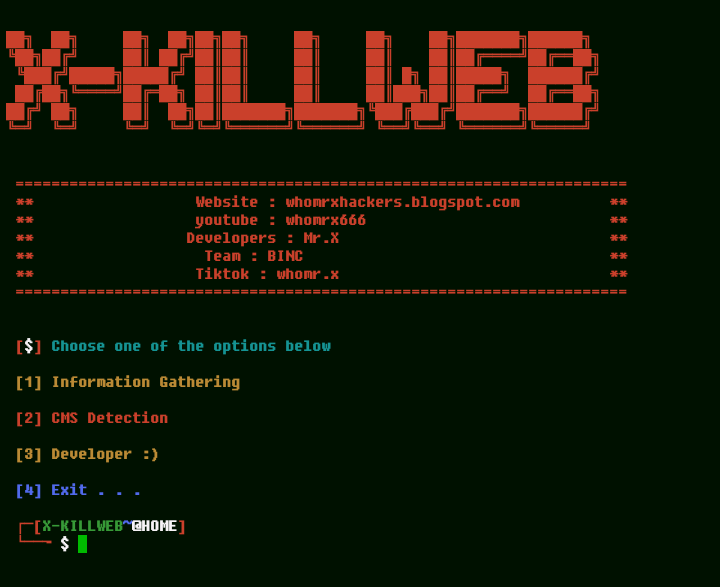

# X-KILLWEB


## introduction
Tool Information Gathering web Write With Python

## Instalations for Termux
```
$ pkg update dan pkg upgrade
$ pkg install python2
$ pkg install git
$ git clone https://github.com/Whomrx666/X-killweb.git
$ cd X-killweb
$ pip install -r requirements.txt
$ python -m pip install (nama module yang belum terinstall)
$ python X-killweb.py
```
## Instalations for Linux
```
$ apt update && apt upgrade
$ apt install python2
$ apt install python3
$ apt install git
$ git clone https://github.com/Whomrx666/X-killweb.git
$ cd X-killweb
$ pip3 install -r requirements.txt
$ python3 webkiller.py 
```
## Operating Systems Tested
- Kali Linux 2020.1
- Windows 10
- Ubuntu 19.10
- Termux

## Instructions
- **Information gathering**: There are many tools for the initial stages of testing the security of computer systems and networks
- **Cms detection**: There are several software tools that allow users to create and modify content on websites
- **Developer**: Shows several social media maker tools
- **Exit**: To exit tools
### Original Author
<a href="https://github.com/Whomrx666"></a>

Follow me: [Whatsapp](https://wa.me/6287855190571),[Youtube](https://youtube.com/@whomrx666),[Tiktok](https://www.tiktok.com/@whomr.x),[Facebook](https://www.facebook.com/whomrx.666),[Telegram](https://t.me/@Whomr_X),&[Website](https://whomrxhackers.blogspot.com/)

**If you want to donate, click on the button**
<a href="https://saweria.co/whomrx"></a>

